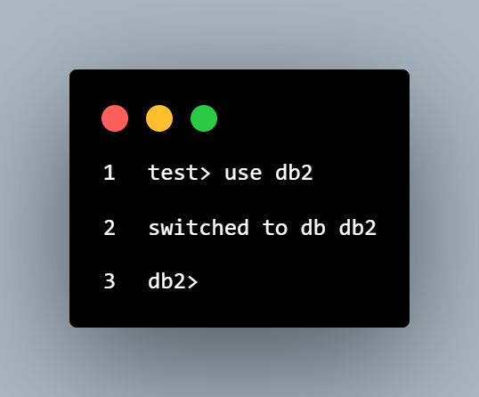

## Comandos MongoDB

**Mostrar bases de datos**

* *show dbs*

`Ejemplo:` 

**Crear y usar una base de datos**

* *use nombre_database*

`Ejemplo:`  

**Crear coleccion**
* *db.createCollection("nombre_coleccion")*

`Ejemplo:`  

**Mostrar colecciones**

* *show collections*

`Ejemplo:`  

<!---->
**insertOne**

* *db.nombre_coleccion.insertOne({"campo":"valor", campo:valor...})*

`Ejemplo:` 

**insertMany**

* *db.nombre_coleccion.insertMany([{campo:"valor" , campo: valor} , {campo:"valor", campo: valor , campo:"valor"}...])*

`Ejemplo:` 

**drop collection & drop database**

* *db.nombre_coleccion.drop()*

* *db.dropDatabase()*

`Ejemplo:` 

**find**

`Ejemplo:` 

* *db.nombre_coleccion.find({})*

**findOne**

`Ejemplo:` 

* *db.nombre_coleccion.findOne({campo:{$in:[valor-valores)]}})*

<!--Actualiza un solo documento-->
**updateOne**

* *db.nombre_coleccion.updateOne({campo:'valor'},{$set:{campo:'valor'}})*

`Ejemplo:` 

**updateMany**

* *db.nombre_coleccion.updateMany({campo:{$gt:valor}},
    {$set:{campo:valor}})*

`Ejemplo:`    

**deleteOne**

* *db.nombre_coleccion.deleteOne({"campo":"valor"})*

`Ejemplo:` 

<!--remplaza un docuemtno por uno nuevo-->
**replaceOne**

* *db.nombre_coleccion.replaceOne({"campo":valor},{"campo":"valor"})*

`Ejemplo:` 

---
### Operadores

<!--muestra los documentos que cumplen con las condiciones , pueden ser multiples-->
**operador and**

`Ejemplo:`

* *db.libros.find({$and: [{editorial: "Biblio"},{precio:{$in:[20, 25]}}]})*

<!--muestra los docuemtnos que puede que cumplan con alguna de las condiciones-->
**operador or**

`Ejemplo:`

* *db.libros.find({$or:[{ editorial: "Biblio" },{ autor: "Borges" }]})*

<!--Coincide con documentos en donde los valores coinciden con uno especificado-->
**operador eq**
 
 `Ejemplo:`

* *db.libros.find({titulo:{$eq:'JSON para todos'}})*

<!--Coincide con documentos en donde los valores que son mayores coinciden con uno especificado-->
**operador gt**

`Ejemplo:`

* *db.libros.find({precio:{$gt:25}})*

**operador gt & eq**

`Ejemplo:`

* *db.libros.find({precio:{$gt:25}&&{$eq:25}})*

<!--Coincide con documentos en donde los valores que son mayores o iguales coinciden con uno especificado-->
**operador gte**

`Ejemplo:`

* *db.libros.find({precio:{$gte:20}})*

<!--Coincide con documentos en donde los valores que son menores coinciden con uno especificado-->
**operador lt**

`Ejemplo:`

* *db.libros.find({cantidad : {$lt:5}})*

**operador gt & lt**

`Ejemplo:`

* *db.libros.find({precio:{$gt:25},cantidad:{$lt:15}})*

**operador inc**

`Ejemplo:`

* *db.libros.updateMany({"_id":10},{$inc:{precio:5}})*

**sort**

`Ejemplo:`

* *db.nombre_coleccion.find({},{campo:valor,campo:valor,campo:valor....}).sort({campo:valor,campo:valor})*

**operador gt & mul**

`Ejemplo:`

* *db.libros.updateMany({cantidades:{$gt:20}},{$mul:{precio:2}})*

**operador sort & limit**

`Ejemplo:`

* *db.nombre_coleccion.find({},{"titulo":1 , "precio": 1,"_id":0 , "editorial":1}).sort({titulo:1}).limit(2)*

**sort & size**

`Ejemplo:`

* *db.nombre_coleccion.find({},{"titulo":1 , "precio": 1,"_id":0 , "editorial":1}).skip(2).sort({titulo:1}).size()}*

---
<!--agregacion mediante filtrado,ordenamietno o agrupacion-->
**aggregate**

* *db.libros.aggregate( [{$match:{editorial:'Biblio'}} , {$project:{_id:0,titulo:1,precio:1, 'Nombre Editorial' : '$editorial' }}])*

`Ejemplo:`

<!--Cuenta los documentos que hay en una coleccion-->
**countDocuments**
* *db.libros.countDocuments()*

* *db.libros.countDocuments({editorial:'Biblio'})*

`Ejemplo:`

